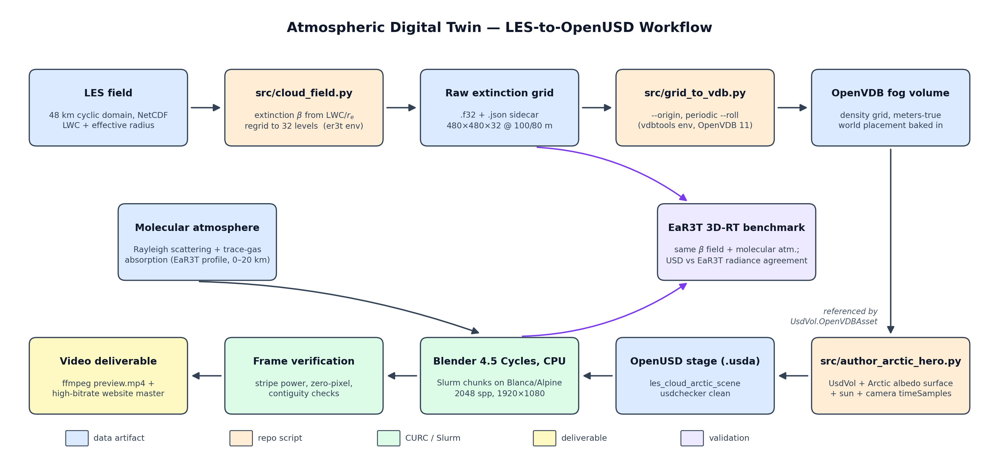

# USD-RT Clouds: Atmospheric Digital Twin in OpenUSD

This project builds a physically grounded cloud digital-twin pipeline in OpenUSD. The core thesis is:

> ingest a real 3D atmospheric cloud field, author it as an OpenUSD volume, render it, and validate the rendered light transport against an EaR3T 3D radiative-transfer benchmark.

The early weeks build the visualization practice pipeline: bounded atmospheric domain, ocean/land and Arctic albedo surfaces, animated clouds, sun-angle variants, renderer shadow experiments, and a true `UsdVol`/OpenVDB cloud. Phase 8 is the research moat: replace synthetic clouds with a real LES field and produce a quantitative USD-render-vs-EaR3T agreement metric.

## Current Status

- Weeks 1-7 are implemented as reproducible OpenUSD scenes.
- Week 7 authors a `UsdVol.Volume` backed by an OpenVDB density grid.
- Phase 8 ingestion is in progress: `src/cloud_field.py` extracts a cloudiest LES tile, computes physical extinction, and writes local processed artifacts.
- The next major milestone is converting the real LES extinction field to VDB, rendering it, and comparing the rendered radiance against EaR3T.

## Workflow Overview



The pipeline runs left-to-right along the top row and right-to-left along the bottom: the real LES field is converted to physical extinction (`src/cloud_field.py`), written as an OpenVDB fog volume (`src/grid_to_vdb.py`), referenced by the OpenUSD hero stage (`src/author_arctic_hero.py`), rendered with Blender Cycles on CPU via Slurm chunks, verified frame-by-frame, and assembled into the video deliverable. The renders also carry a molecular atmosphere — Rayleigh scattering and trace-gas absorption on the same 0–20 km profile EaR3T uses — and the same extinction field feeds the EaR3T 3D-RT benchmark for the render-validation branch, so both sides of the comparison see identical clouds and identical molecular physics.

Regenerate the figure with:

```bash
conda run -n er3t python src/make_workflow_diagram.py
```

## Repository Layout

```text
assets/        OpenUSD stages and lightweight scene assets
src/           Python authoring and processing scripts
tools/         C++ OpenVDB helper tools
repro/         Rebuild and render helper scripts
renders/       Local render outputs, ignored by Git
data/          Local LES/source/processed data, ignored by Git
build/         Local compiled tools, ignored by Git
plan.md        Detailed week-by-week and Phase 8 execution plan
```

Large scientific data, generated VDBs, rendered frames, videos, and compiled binaries are intentionally not committed. Keep the repo source-first and regenerate artifacts locally.

## Data Policy

Do not commit LES, NetCDF/HDF, NumPy, raw binary, VDB, render, or video artifacts to GitHub.

The following are local-only examples:

- `data/7SEAS_*.nc`
- `data/processed/*.npz`
- `data/processed/*.f32`
- `data/processed/*.json`
- `data/processed/*.png`
- `assets/**/vdbs/*.vdb`
- `renders/**/*.png`
- `renders/**/*.mp4`
- `build/`

If a small sample dataset is needed for a public demo, add a tiny documented fixture deliberately and update `.gitignore` with an explicit allow-list entry.

## Pipeline

Run the scene authoring scripts with an OpenUSD-compatible Python environment:

```bash
conda run -n openusd python src/week1_satellite_scene.py
conda run -n openusd python src/week2_timeseries_to_usd.py
conda run -n openusd python src/week3_clouds_vol.py
conda run -n openusd python src/week4_pipeline.py
conda run -n openusd python src/week5_realistic_arctic_cloud_scene.py
conda run -n openusd python src/week6_renderer_shadows.py
conda run -n openusd python src/week7_usdvol_cloud.py
```

Or rebuild the practice scenes in sequence:

```bash
conda run -n openusd python repro/run_demo.py
```

## Phase 8 LES Processing

Phase 8 uses a real SAM-LES 7SEAS shallow-cumulus field stored locally under `data/`. The ingestion script should be run in the environment that has `netCDF4`, `scipy`, `matplotlib`, and EaR3T-compatible dependencies:

```bash
conda run -n er3t python src/cloud_field.py
```

Expected local outputs include processed NumPy fields, raw extinction data, JSON metadata, and a quicklook image under `data/processed/`. These files are generated artifacts and are ignored by Git.

## Outputs

Source-controlled scene outputs:

- `assets/week1/environment.usda`: 50 x 50 x 25 domain, half-ocean/half-land surface, static cloud placeholder
- `assets/week2/clouds_move.usda`: movable cloud system with `motion_mode` variants
- `assets/week3/clouds_vol.usda`: structured cloud voxel/radiance placeholder with `sun_case` variants
- `assets/week4/final_scene.usda`: composed scene with camera and render notes
- `assets/week4/cloud_motion_scene.usda`: cloud-motion composition for video capture
- `assets/week5/realistic_arctic_cloud_scene.usda`: Arctic scene with albedo surfaces, sky lighting, layered clouds, and shadow/cooling cues
- `assets/week6/renderer_shadow_scene.usda`: renderer-shadow experiment with mesh cloud occluders and `UsdLux.DistantLight`
- `assets/week7/usdvol_cloud_scene.usda`: `UsdVol.Volume` scene referencing a local VDB

Local-only generated outputs:

- `assets/week7/vdbs/cloud_density.vdb`
- `renders/validation_report.md`
- `renders/week*/`
- `renders/final.mp4`
- `data/processed/`

## Variants

- `/World/Surfaces.surface_mode`: `split_ocean_land`, `ocean_only`, `land_only`
- `/World/MovingCloudSystem.motion_mode`: `static_cloud`, `manual_transform`, `advected_points`
- `/World.sun_case`: `sun_slant`, `sun_zenith`
- `/World/Scene.sun_case` in the Week 4 final scene: `sun_slant`, `sun_zenith`
- `/World/Lighting.lighting_case` in the Week 5 scene: `polar_low_sun`, `midday_sun`
- `/World.cloud_representation` in the Week 6 scene: `points_preview`, `mesh_occluders`, `future_vdb`
- `/World.shadow_mode` in the Week 6 scene: `renderer_shadow`, `baked_shadow_mask`, `debug_shadow_proxy`
- `/World.sun_case` in the Week 6 scene: `polar_low_sun`, `zenith_sun`
- `/World.cloud_representation` in the Week 7 scene: `usdvol_density`, `points_preview`
- `/World.shadow_mode` in the Week 7 scene: `renderer_volume_shadow`, `surface_albedo_debug`

## Preview

```bash
usdview assets/week4/final_scene.usda
usdview assets/week4/cloud_motion_scene.usda
usdview assets/week5/realistic_arctic_cloud_scene.usda
usdview assets/week6/renderer_shadow_scene.usda
usdview assets/week7/usdvol_cloud_scene.usda
```

Generate Week 7's local VDB before opening the volume scene:

```bash
repro/generate_week7_vdb.sh
```

For render previews:

```bash
repro/render_week5.sh
repro/render_week6.sh
repro/render_week7.sh
```

## Week 7 UsdVol Notes

Week 7 moves the cloud representation to a real USD volume binding:

- `/World/CloudVolume/Volume` is a `UsdVol.Volume`
- `/World/CloudVolume/Fields/Density` is a `UsdVol.OpenVDBAsset`
- the volume has `field:density` targeting that OpenVDB asset
- expected VDB grid name: `density`
- `repro/generate_week7_vdb.sh` compiles `tools/generate_week7_vdb.cpp` against Homebrew OpenVDB and writes the VDB
- `cloud_representation = points_preview` is available for inspection before the `.vdb` file exists

The local `openusd` Python environment can author `UsdVol`, but it does not have `openvdb`/`pyopenvdb` Python bindings. The VDB is generated by a small C++ tool using Homebrew OpenVDB. Render with a volume-capable Hydra delegate or RTX/path tracing for meaningful volume shadows.

If Storm reports `Unknown field data type 'vdb'`, rebuild OpenUSD with `PXR_ENABLE_OPENVDB_SUPPORT=ON`.

## Validation Target

The final validation path is:

1. Extract the real LES cloud tile.
2. Compute extinction from cloud water and effective radius.
3. Feed the same extinction field into both the USD volume and EaR3T.
4. Render a nadir radiance image from the USD scene.
5. Compare the USD render against the EaR3T 3D-RT benchmark with RMSE or percent agreement.

That side-by-side figure and quantitative agreement metric are the centerpiece of the project.
